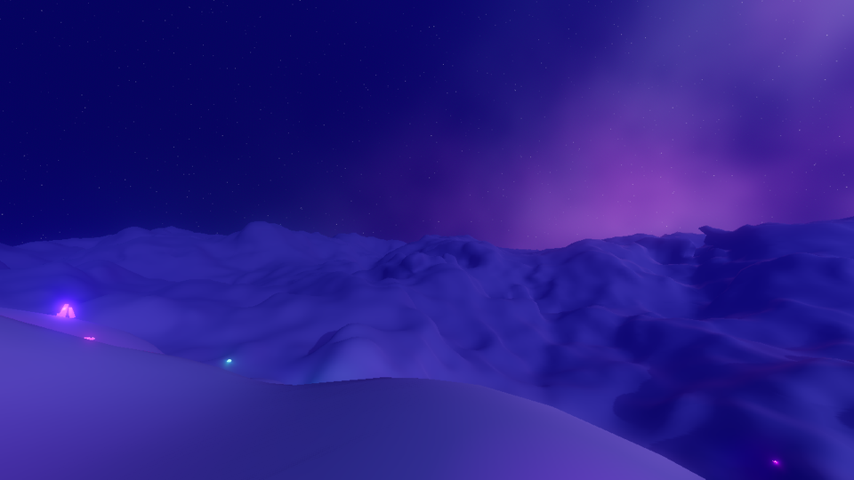
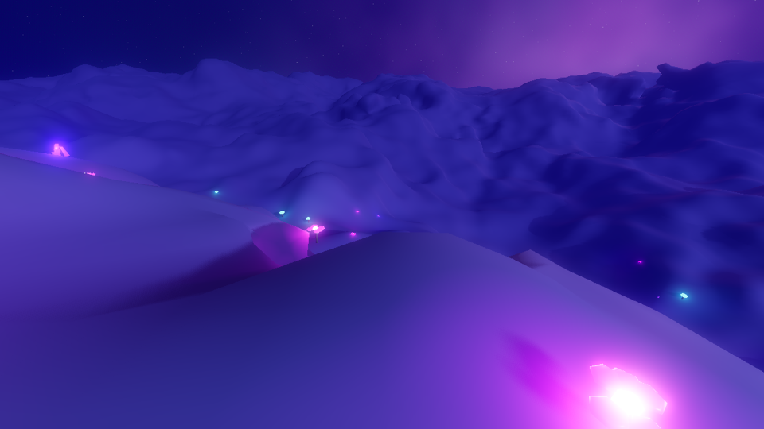
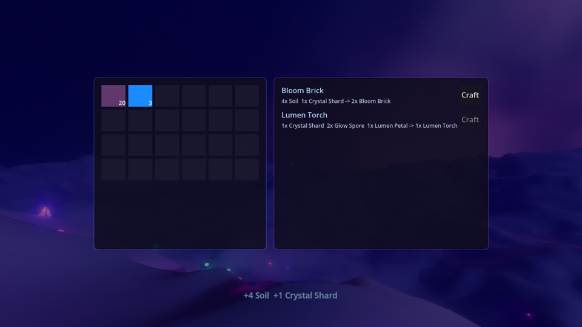
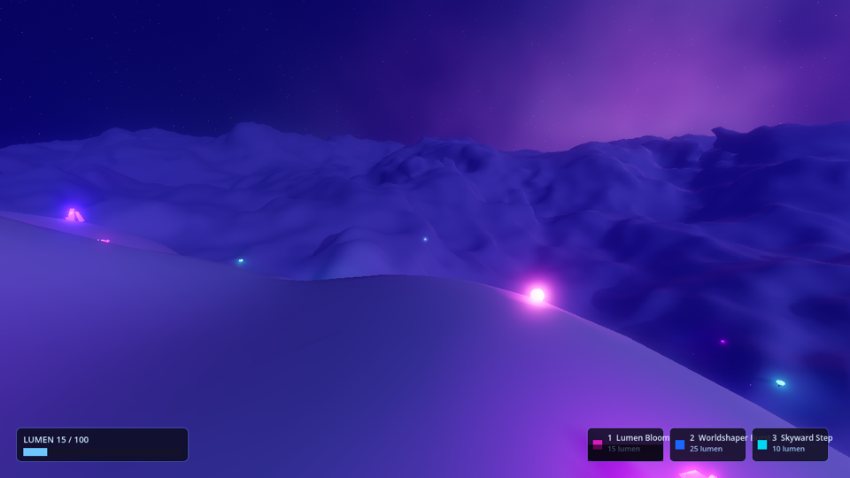
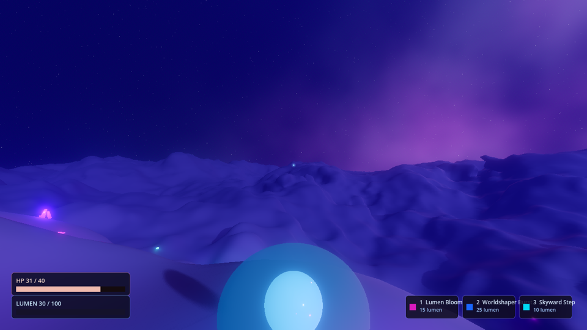
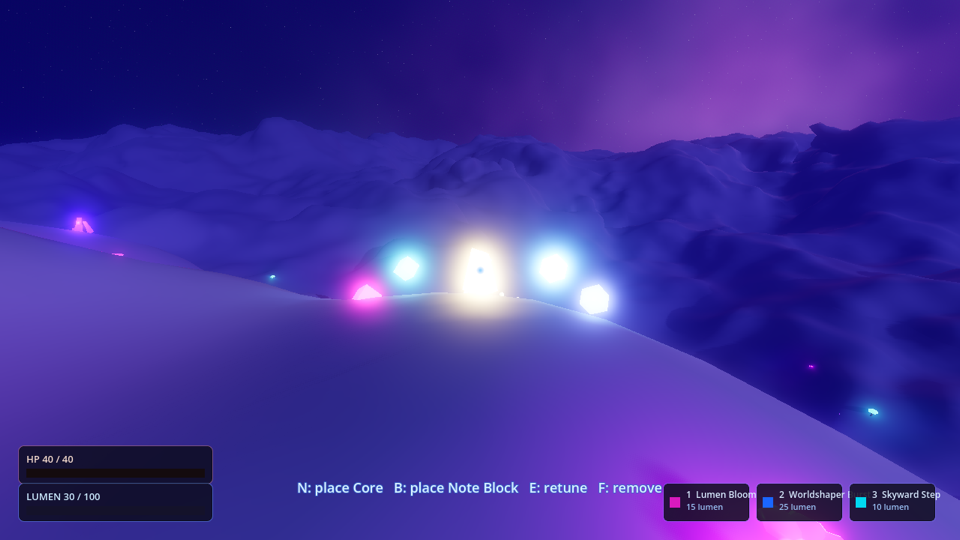

# Anthesis

A cosmic-whimsical open-source voxel adventure game — smooth diggable terrain, Sanderson-inspired magic, deep crafting, and EDM-driven adaptive music.

> **Status: Pre-alpha, playable vertical slice.** You can wander a glowing cosmic world, dig and reshape the terrain, harvest bioluminescent flora, craft, cast lumen magic, fight Umbrals in the dark, and compose music with in-world sequencer blocks — all to an adaptive EDM soundtrack.



---

## Vision

### 1. Beautiful Living Cosmic World
Bioluminescent flora, nebula skies, volumetric fog. The world is a place you want to inhabit before you ever swing a pickaxe.

### 2. Dig and Build
Fully smooth, continuous SDF terrain — not blocky cubes. Every surface is diggable. Caves, tunnels, arches, and overhangs emerge naturally.

### 3. Magic and Crafting
A hard-magic system (Sanderson rules: defined costs, defined limits). **Lumen** — living light harvested from flora — powers abilities with fixed costs and cooldowns. Spells, items, recipes, and creatures are data-driven `.tres` resources.

### 4. Music as a Pillar
The soundtrack is generative and adaptive: synced stems fade in and out with the intensity of play. And the signature mechanic — an **in-world music sequencer**: craft a Sequencer Core, ring it with Note Blocks, and your spatial arrangement *is* the pattern, locked to the soundtrack's transport.

### 5. Adventure and Combat
Exploration-first. **Umbrals** — shadow wisps with glowing cores — condense in the dark, away from the safety of glowing flora.

---

## Screenshots

| | |
|---|---|
|  Carving the terrain |  Inventory + crafting |
|  Lumen Bloom cast |  Shardling combat |
|  The in-world music sequencer — a Core ringed by Note Blocks | |

---

## Status

| Phase | Description | State |
|-------|-------------|-------|
| 0 — Foundation | Engine setup, voxel module, CI, tests, structure | ✅ |
| 1 — The World | Smooth diggable SDF terrain, cosmic presentation, glowing flora | ✅ |
| 2 — Crafting | Inventory, data-driven items/recipes, dig loot, harvesting | ✅ |
| 3 — Magic | Tick substrate, lumen well, rule-gated abilities | ✅ |
| 4 — Combat | Umbral enemies, deterministic AI, darkness spawning | ✅ |
| 5 — Adaptive Music | Procedural EDM stems, intensity-driven mix | ✅ |
| 6 — Music Sequencer | In-world composing with craftable blocks (signature) | ✅ |
| 7 — Co-op | Authoritative command layer → multiplayer | **In progress** |

---

## Tech

- **Engine**: Godot 4.6 (custom build) + [godot_voxel v1.6](https://github.com/Zylann/godot_voxel) — smooth Transvoxel/SDF meshing
- **Renderer**: Forward+ (Metal on macOS, Vulkan elsewhere)
- **Language**: GDScript (tabs, snake_case, data-driven `.tres` resources)
- **Testing**: GUT 9.6.0 (vendored at `addons/gut/`), headless CI
- **Lint / format**: gdtoolkit 4.x (`gdformat`, `gdlint`)
- **Audio**: Godot built-in adaptive stem system; all music + note samples procedurally synthesized by committed, seeded Python scripts (CC0)
- **Platform**: macOS (primary dev), Linux (CI)

Architecture overview: [docs/ARCHITECTURE.md](docs/ARCHITECTURE.md)

---

## Getting Started

**Prerequisites**: macOS or Linux, `git`, `make`, Python 3 (for gdtoolkit).

```bash
# 1. Clone
git clone https://github.com/drn/anthesis.git
cd anthesis

# 2. Fetch the prebuilt Godot + Voxel editor binary
scripts/setup.sh

# 3. Launch the game
make run

# 4. Open the project in the editor
make edit

# 5. Run tests (headless)
make test
```

The editor binary lands at `tools/godot/macos_editor.app` (gitignored).

**Controls**: WASD move · Space jump · LMB dig · RMB place · F strike · E harvest/interact · 1-3 cast abilities · N/B place sequencer/note blocks · Tab inventory · Esc release mouse

---

## Contributing

See [CONTRIBUTING.md](CONTRIBUTING.md) for the full guide.

Short version: every change ships with tests, lint passes, squash-merge only.

---

## License

MIT — see [LICENSE](LICENSE). Generated audio assets are CC0.
